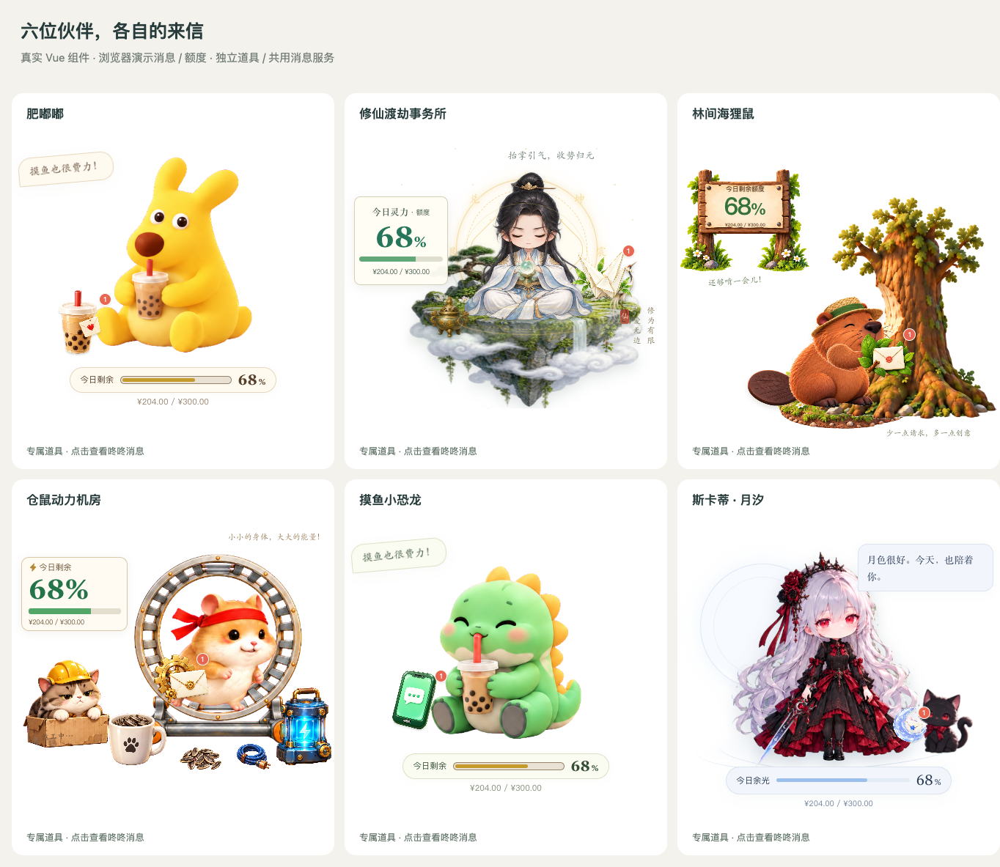

# 六只桌宠 · 独立消息道具修订

2026-09-14。按用户提供的五张参考图，延续充气牛马的独立道具与共用消息服务处理方式。当前修改尚未发布安装包。

## 逐角色处理

位置为方形场景的百分比，尺寸为场景宽度的百分比；数字、姓名、消息正文、按钮与角标均由界面实时渲染。

| 桌宠 | 新物料与落点 | x / y / 尺寸 | 提醒动作 |
| --- | --- | --- | --- |
| 肥嘟嘟 | 爱心便笺奶茶，角色左脚旁；不随瘫软、翻身或工作动作变形 | 9 / 51 / 23 | 杯身轻倾一次 |
| 修仙 | 宣纸纸鹤与竹叶，角色右肩侧；保留原仙人、法宝和装扮 | 69 / 36 / 22；迷你 73 / 38 / 22 | 纸鹤轻浮一次 |
| 海狸鼠 | 树叶、木枝与奶油信封，爪边独立摆放；树倒后仍能点击 | 54 / 62 / 21 | 树叶信轻摆一次 |
| 仓鼠 | 黄铜齿轮与信封，跑轮左侧空位；为盖被后的睡脸让位 | 43 / 43 / 19 | 齿轮信轻倾一次 |
| 小恐龙 | 薄荷绿手机，身体左侧；保留原奶茶、电脑和短动作 | 10 / 48 / 23 | 手机轻振一次 |
| 月汐 | 银蓝月牙与星封信，夜影脚前；避开猫脸，两种形态共用 | 65 / 60 / 14；迷你 63 / 54 / 16 | 月牙信轻浮一次 |

新道具均由内置 image_gen 按对应参考单独生成，使用纯品红底以保留绿叶和手机颜色。运行文件为 `public/assets/<scene>/message-prop.png`；`CharacterMessageParcel.vue` 解码透明度并去除边缘溢色。原始生成路径记录在 [sources.json](sources.json)，运行副本与哈希已登记 `docs/native-assets.json`。

提示约束：独立单件道具、柔和立体材质、完整轮廓、安全留白；不含角色、手脚、底板、文字、角标或红框。没有修改原角色贴图或制作举手 / 递信的新角色帧。

## 消息与动作

- 六只复用 `PetNotices`、独立气泡与消息卡、咚咚唤起、账户状态和计数；不复制服务。
- 玩法中道具仍可点击，新气泡等待动作结束；修仙随机事件同样暂缓气泡。面板、拖窗、错误提示、海狸鼠截图期间入口让位。
- 关闭气泡不清角标；消息卡内实际出现的提醒才确认。暂停、隐藏正文、换号清理、额度账户独立沿用共享规则。
- 新消息只执行一次角色对应的道具短动作；轻柔模式与系统减少动态效果不播放动作。位置与尺寸独立于角色的变形、换装和额度。
- 修正月汐换装监听：只在服装、形态或武器的实际值改变时重置动作；新的消息 / 额度快照不再取消当前动作。
- 打开独立消息卡前先同步打开状态。肥嘟嘟、小恐龙与月汐识别此状态，避免卡片带来的失焦额外取消动作；正常离开桌宠仍遵循原来的失焦规则，短动作仍按原时长自然结束。

## 验证边界

- 源码：149 个 TypeScript 测试、5 个脚本测试通过；类型检查、构建、77 个旧渲染 / 交互文件与原素材一致性校验通过。构建仍有既有的大分块提示。
- 浏览器：首轮六只 × 4 尺寸 × 昼夜，共 48 组布局、点击、外侧气泡、卡片关闭和咚咚唤起桥接检查通过；全动作 / 额度 / 换装矩阵共 2,996 个状态采样通过。最终位置及月汐修复后再通过 1,344 个动作 / 换装采样和 16 组布局；完整结果见 [checks.json](checks.json)。
- 六只完整消息流程通过：持续动作中点道具、动作保持、消息暂缓及恢复、面板让位、键盘打开、隐私、暂停、退出额度账户保留消息、咚咚换号清理。脚本为 `scripts/character-message-flow-qa.cjs`。
- 布局和状态脚本为 `scripts/character-message-layout-qa.cjs` 与 `scripts/character-message-states-qa.cjs`。动作复核图独立于 UI 几何判定，仓鼠睡脸与夜影脸部的位置调整来自实际截图。肥嘟嘟 / 小恐龙喝奶茶、月汐哼唱中打开消息卡的短动作失焦回归也通过；共享悬停计时、会话分组、可见确认和更新互斥回归通过。
- **未经本轮验证：**macOS / Windows 原生窗口焦点与屏幕边缘、真实咚咚消息接收和客户端唤起、安装包。浏览器的演示账户与窗口 / IPC 模拟不等于原生或真实账户通过；本轮未发布新版本。

## 实际组件对照

[肥嘟嘟动作](feidudu-actions.png) · [修仙动作](cultivation-actions.png) · [海狸鼠动作](beaver-actions.png) · [仓鼠动作](hamster-actions.png) · [小恐龙动作](dinosaur-actions.png) · [月汐动作与两种形态](skadi-actions.png)。
