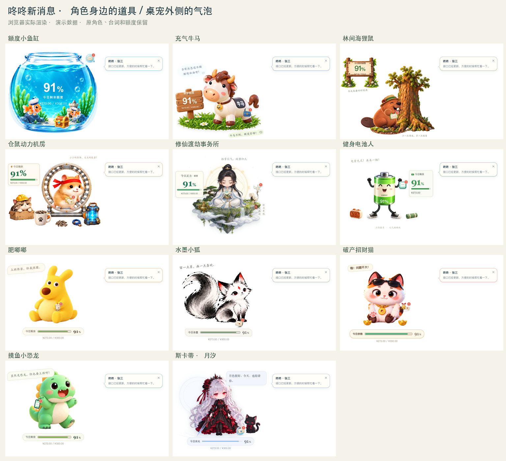

# 消息位置修正 · 2026-09-14

按用户提供的三张 11 角色参考图校准。这里的 PNG 来自实际浏览器组件渲染，全部使用演示数据。

- 道具靠近手边、身侧或脚边；月汐保留右上台词，信封移到裙摆与小猫附近。
- 短气泡在桌宠外侧独立显示，约 5 秒收起；鼠标移入暂停。原生窗口不可获取输入焦点，鼠标第一下可以直接操作。
- 点击气泡或道具展开外侧消息卡，屏幕右边空间不足时换左侧；不修改桌宠尺寸。单条消息卡高 240，多条消息卡高 360，长内容滚动查看。
- 卡片中的“打开咚咚”唤起本机客户端；加载状态、防重复点击、具体错误和重试均已补齐。不自动跳到具体会话。
- 180 / 190 像素的牛马、电池、小狐、月汐另设道具位置，避开操作栏与额度条。

## 验证

| 层面 | 结果 |
| --- | --- |
| 浏览器位置 / 点击 | 11 角色 × 440 / 300 / 190 / 180 像素 × 昼夜，共 88 种组合；标准与紧凑 44 组通过，迷你修正后 44 组通过。核对气泡在窗口外、道具不遮台词 / 额度 / 操作按钮、卡片能调用打开接口。 |
| 浏览器交互 | 悬停暂停、自动收起不清角标、气泡打开卡片、会话分组、仅可见消息确认、玩法延后、更新互斥通过。账户隔离、隐私、旧来源回调拒绝、打开失败重试通过。 |
| 源码 / 构建 | 149 项前端测试、5 项发布脚本测试、26 项 Rust 测试通过；2 项需要真实账户的 Rust 测试未在本轮重跑。前端构建及原角色 / 资源一致性检查通过。 |
| macOS 原生 | 调试应用实际收到新消息并出现外侧气泡；实际点击原生消息页的“打开咚咚”，客户端窗口出现。未保存真实消息截图。最后补充的不可获取焦点属性已编译，但未测量实际输入焦点保留行为。 |
| Windows 原生 | 当前环境不能验证；直接启动已运行客户端路径的唤起改动仍待 Windows 安装包实测。 |

复测脚本：`scripts/message-notice-layout-qa.cjs`、`scripts/message-notice-flow-qa.cjs`、`scripts/message-notice-qa.cjs`。交互预览：本地 Vite 的 `/tests/fixtures/message-gallery.html`。

本轮修正尚未推送或发布新版本；GitHub 上现有 v0.4.4 不包含这些修正。
