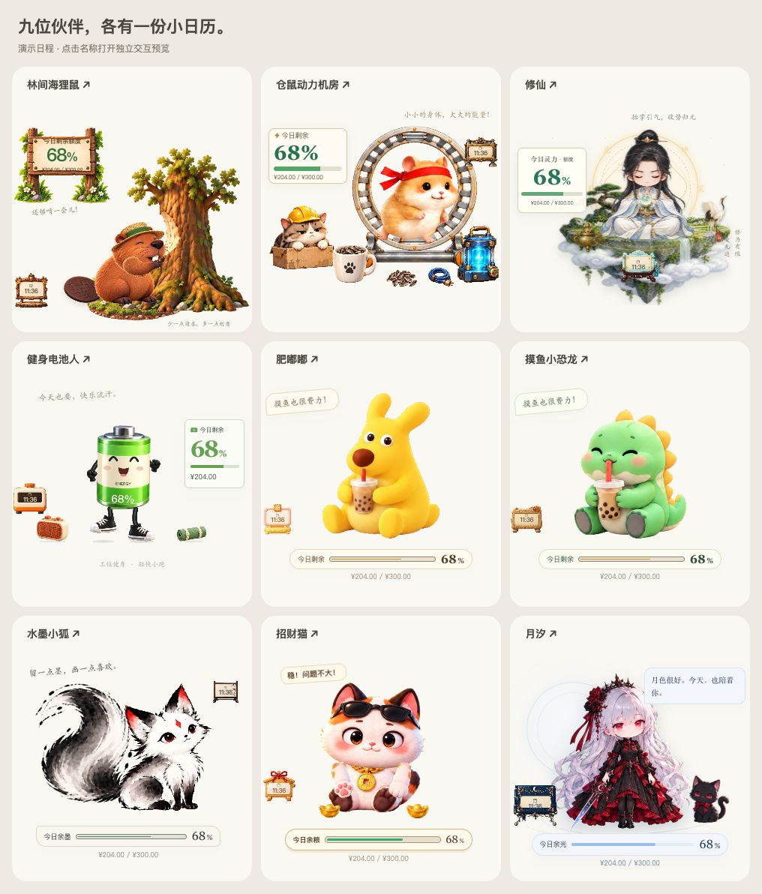
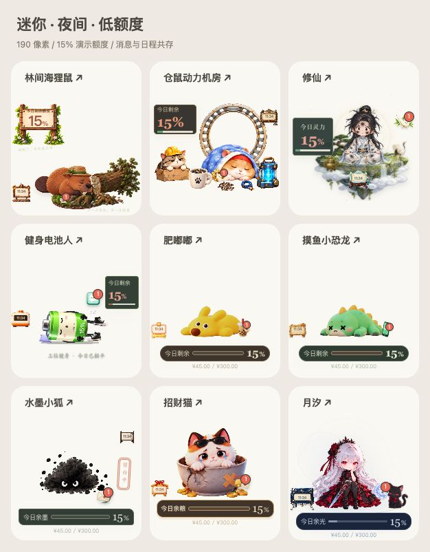

# 九位伙伴的日程小道具

2026-09-15 · 已接入 Tauri 源码。连同牛马与小鱼缸，当前 11 只桌宠都可查看当天安排并收到提醒。

## 交互与物料

林间木牌、机房值班牌、云纹玉简、健身计时器、奶油便签、化石日历、水墨书签、招福绘马和月汐手札分别独立制作。原画保存于 `rust-desktop/public/assets/<scene>/calendar-prop.png`；内置 image_gen 的完整提示词见 [生产记录](asset-production.md)。原始 PNG 保留，运行时使用共享绿幕解码；物料保持正方形原图比例，不随命中框拉伸。

点击道具打开独立日程卡；标题及地点可隐藏，默认开始前 5 分钟提醒，支持知道了、稍后提醒。每只都有提前与到点的专属短句。到点只轻亮一次纸面，轻柔与系统减少动态效果静止。主要互动、拖窗、覆盖面板、消息面板展开时入口让位；原有角色图集、道具、动作状态机和窗口手势保持原实现。

小尺寸中的数字只作为环境提示，详细事项在独立窗口阅读。所有安排来自同一共享服务，换角色不另起轮询或重置提醒记录。

## 验证证据

- `npm run build`：契约、类型检查、Vite 构建通过。保留已有大包体提示。
- `npm test`：153 个 TypeScript 测试及 5 个脚本测试通过。
- `cargo test`：34 通过、3 个既有测试忽略。
- `npm run verify:parity`：77 份渲染 / 动作 / 手势基线、56 份旧物料、48 份 Tauri 物料哈希通过；只更新新增日程入口对应的四份 Experience 审阅哈希。
- [浏览器结果](qa/result.json)：432 组布局（9 只 × 4 尺寸 × 2 昼夜 × 6 额度）、45 次换装、88 次玩法菜单操作、9 次日程打开、900 帧待机采样、18 次确认 / 稍后响应全部通过。迷你包含 180 与 190px，额度包含 15%、0 与未知。强制显示原操作栏检查互相覆盖，日程与消息同时存在。
- [实际点击记录](qa/click-result.json)：月汐保持 `action-idle`，未触发拖窗；日程展开时消息入口隐藏。

使用 `npm run dev -- --port 5189` 后访问 `tests/fixtures/calendar-gallery.html` 查看总览，点击各名称进入独立演示。`calendar-nine-qa.html` 可运行上述本地检查；均使用演示账户和日程，不请求真实咚咚数据。

原生系统窗口摆放、真实咚咚账户到点提醒、穿透 / 托盘 / 系统免打扰没有在本轮实机验收。未提交、推送、打安装包或发布。
